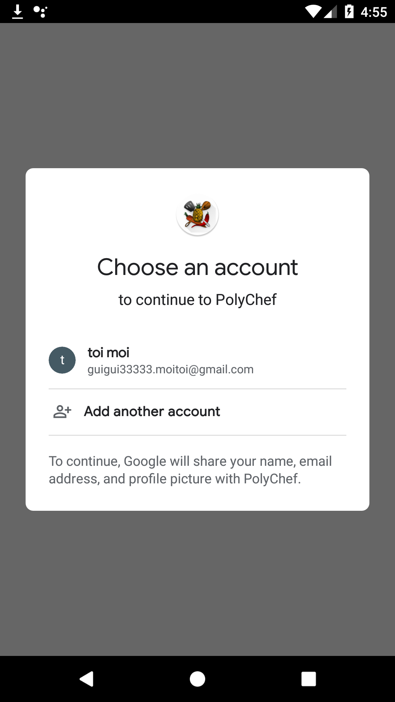

# SDP_PolyChef
EPFL Software development project (CS-306) - PolyChef App

## Pitch:
We are developing an application for all the people that like to cook. The goal is to have an easy way to share your incredible recipe ideas with your friends and followers through a social network app based on the recipe that you publish. 
You can give feedback to the creator of recipes you have tried by either letting a comment or rating the recipes. Rating will help the best cook and recipes creator get reward (internet points) and more visibility so that it is easier to find good recipes that other people have tried. 
When you cook, your hands are not always clean enough to check the recipe on your phone so the app will also integrate vocal command so that you can get the information you need by asking the app.

## Main caracteritics and features of PolyChef:

- The app has been built using Android Studio using compileSdkVersion 29 (minimum minSdkVersion is 24) and java sourceCompatibility 1.8

- Connect using your Google account (when you are not connected you can access only a set of basic recipes)

- Once connected you can see the recipes posted by the community:

  
  

- Search for recipes / users and apply different filters

- Post your own recipes (and modify them later if needed)

- Rate and comment the posted recipes

- Get your personnal user profile and display your achievements

- Subscribe to other Chefs

- Use the continuous voice recognition feature to ask PolyChef to read you the instructions when your hands are dirty. To proceed, turn on the voice recognition witch on a recipe, then say out loud "Poly Chef", wait half a second then say of the command you need: "Next", "Reapeat", "Previous". Speak with a clear english accent and "Poly Chef" might be better detected by prononcing more like "Pola Chef".

- Receive notifications when users you subscribe to post a new recipes

- Favorite the best recipes so you can access it offline

